# Documentación operaciones CRUD con CURL

## Crear un estudiante con el comando POST

Se realiza una petición POST al servidor con el objetivo de registrar un nuevo estudiante utilizando los datos enviados.
La información debe enviarse en formato JSON y, si la operación se procesa correctamente, el servidor añadirá el nuevo estudiante a la base de datos.

### El comando es:

```bash
curl -i --request POST http://localhost:4000/students \
  --header "Content-Type: application/json" \
  --data '{"id":"8","name":"Nuevo Estudiante","email":"nuevo@example.com","enrollmentDate":"2025-01-01","active":true,"level":"beginner"}'

```

### El comando podemos dividirlo en varias secciones: 

    curl: Herramienta que permite enviar solicitudes HTTP desde la terminal.
-i: Hace que se muestren tanto los encabezados de la respuesta como el contenido devuelto.
-X POST: Especifica que queremos usar el método POST. Si no se indicara, curl emplearía GET por defecto.
-H "Content-Type: application/json": Agrega un encabezado que informa al servidor de que el cuerpo de la petición está en formato JSON. Es necesario cuando enviamos datos en este formato.
-d: Permite incluir el cuerpo de la solicitud en formato JSON. Cuando utilizamos -d, curl asume automáticamente el método POST salvo que indiquemos otro mediante -X.

Usamos el método POST porque es el adecuado para crear o agregar nuevos recursos en el servidor.
El encabezado Content-Type: application/json es imprescindible cuando enviamos un cuerpo en formato JSON, ya que el servidor necesita saber cómo interpretar los datos enviados.

### Respuesta real HTTP

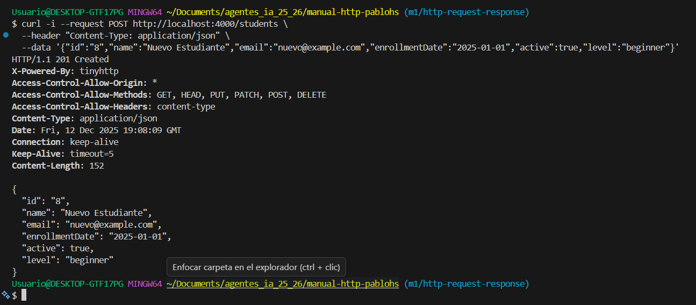

### Explicación del código de estado HTTP:

El servidor devuelve un 201 Created, lo que significa que el nuevo recurso se ha generado correctamente en la base de datos.
Este código de estado confirma que la petición POST se ha ejecutado sin problemas y que el estudiante “Nuevo Estudiante” ha sido incorporado al registro de estudiantes.


## Leer los datos de todos los estudiantes con el comando GET
Se realiza una petición GET al endpoint /students con el objetivo de obtener el listado completo de estudiantes registrados en la base de datos.
Esta operación es únicamente de consulta, por lo que no altera ningún dato del servidor.

### El comando es: 
```bash
    curl -i -X GET http://localhost:4000/students
```

### El comando podemos dividirlo en varias secciones: 

curl: Es la herramienta utilizada para enviar solicitudes HTTP desde la línea de comandos.
-i: Hace que en la respuesta se muestren tanto los encabezados como el contenido devuelto por el servidor.
-X: Permite indicar explícitamente qué método HTTP queremos usar. Si no se especifica, curl emplea GET por defecto.
GET: Es el método elegido en esta operación, ya que se utiliza para obtener información almacenada en el servidor. Además, es el método predeterminado de curl cuando no se indica otro.

### Respuesta real HTTP

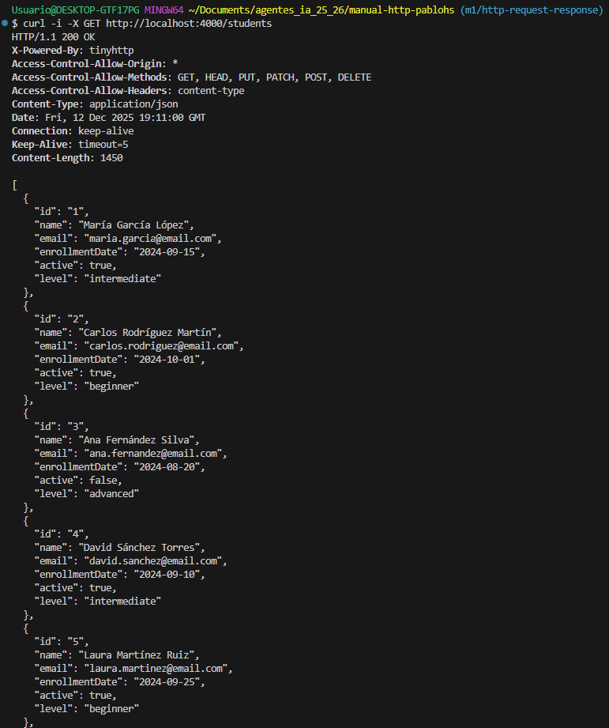
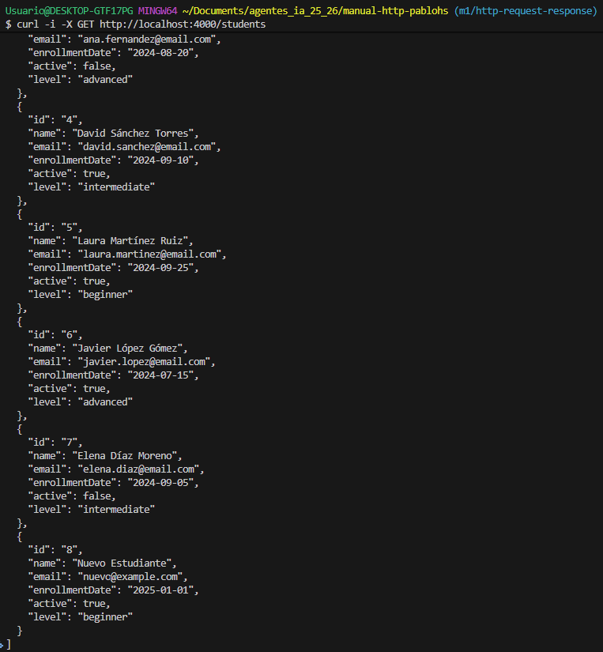


### Explicación del código de estado HTTP:

El servidor responde con un código 200 OK, lo que confirma que la petición se ha procesado correctamente.
Esto significa que los datos solicitados están disponibles y, por ello, se incluyen en el cuerpo de la respuesta.

## Leer los datos de un solo estudiante con el comando GET
Se realiza una petición GET al endpoint /students indicando el ID del estudiante que queremos consultar. Esto permite obtener únicamente la información del alumno seleccionado.
Al tratarse de una operación de lectura, no se produce ningún cambio en el estado del servidor.

### El comando es: 
```bash
    curl -i -X GET http://localhost:4000/students/3
```

### El comando podemos dividirlo en varias secciones: 

curl: Comando utilizado para enviar solicitudes HTTP desde la terminal.
-i: Muestra tanto los encabezados como el cuerpo de la respuesta del servidor.
-X: Permite especificar el método HTTP que se desea utilizar. Si no se indica, curl utiliza GET de forma predeterminada.
GET: Método empleado en esta solicitud, ya que sirve para obtener información almacenada en el servidor. También es el método por defecto de curl cuando no se especifica otro.

http://localhost:4000/students/3 es el enlace que usaremos para realizar la operación. En este caso, al endpoint se le añade un 3 para especificar el id que queremos

### Respuesta real HTTP

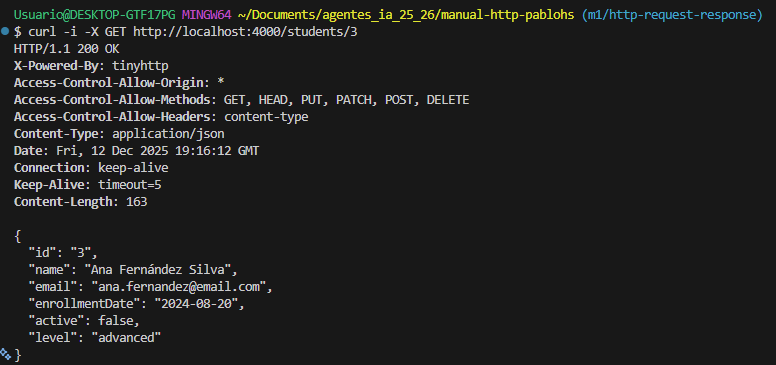


### Explicación del código de estado HTTP:

El servidor devuelve un 200 OK, lo que confirma que la solicitud se ha gestionado correctamente.
Esto indica que la información del estudiante se ha recuperado y mostrado exitosamente.

## Actualizar todos los campos de un estudiante con el comando PUT

El método PUT se emplea para actualizar un recurso existente de manera completa.
Por ello, es necesario enviar todos los campos del estudiante, ya que PUT reemplaza el objeto original por el nuevo que se proporciona.

### El comando es:

```bash
curl -i -X PUT http://localhost:4000/students/2 \
  -H "Content-Type: application/json" \
  -d '{"id":"2","name":"Carlos Editado","email":"carlos-editado@example.com","enrollmentDate":"2024-11-05","active":false,"level":"advanced"}'

```

### El comando podemos dividirlo en varias secciones: 

curl: Herramienta para enviar solicitudes HTTP desde la terminal.
-i: Muestra tanto los encabezados como el contenido de la respuesta del servidor.
-X: Permite especificar el método HTTP a utilizar; si no se indica, se emplea GET por defecto.
-H: Sirve para añadir encabezados a la petición. En este caso, "Content-Type: application/json" indica que el cuerpo se enviará en formato JSON.
-d: Define el contenido de la solicitud. Al usar -d, curl asume por defecto el método POST, por lo que se requiere -X si se desea usar otro método. Aquí se envía la información completa de un estudiante para actualizarlo.

PUT: Método utilizado para reemplazar completamente un recurso existente con los datos que se envían en la solicitud.


### Respuesta real HTTP

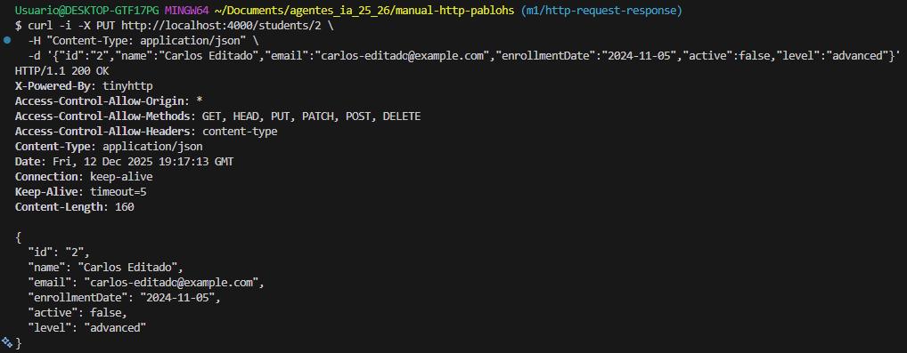


### Explicación del código de estado HTTP:

El servidor responde con un código 200 OK, lo que confirma que la solicitud se ha procesado correctamente.
Esto indica que los datos del estudiante se han actualizado satisfactoriamente.

## Actualizar un campo de un estudiante con el comando PATCH

Se realiza una petición PATCH al endpoint /students especificando el ID del estudiante que se desea actualizar parcialmente.
Solo es necesario enviar los campos que queremos modificar, no todo el objeto completo.

### El comando es: 
```bash
    curl -i -X PATCH http://localhost:4000/students/5 \
    -H "Content-Type: application/json" \
    -d '{"active": false}'

```

### El comando podemos dividirlo en varias secciones: 

curl: Comando utilizado para enviar solicitudes HTTP desde la terminal.
-i: Muestra los encabezados de la respuesta junto con el cuerpo.
-X: Permite seleccionar el método HTTP que se desea usar; si no se especifica, curl usa GET por defecto.
-H: Sirve para añadir encabezados a la solicitud. En este caso, "Content-Type: application/json" indica que el cuerpo se envía en formato JSON.
-d: Define el contenido de la petición. Al usar -d, curl asume por defecto el método POST, por lo que es necesario -X si se desea usar otro método. Aquí se envían solo los campos que queremos modificar del estudiante.

PATCH: Método utilizado para actualizar parcialmente un recurso existente, cambiando únicamente los campos indicados sin reemplazar todo el objeto.


### Respuesta real HTTP

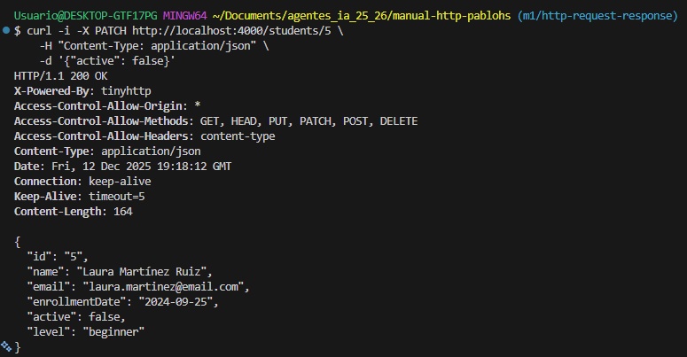


### Explicación del código de estado HTTP:

El servidor responde con un código 200 OK, lo que confirma que la petición se ha ejecutado correctamente.
Esto indica que los campos especificados del estudiante se han actualizado con éxito.

## Eliminar un estudiante con el comando DELETE

Se realiza una petición DELETE al endpoint /students indicando el ID del estudiante que se desea eliminar de la base de datos.

### El comando es: 
```bash
    curl -i -X DELETE http://localhost:4000/students/7
```

### El comando podemos dividirlo en varias secciones: 

curl: Herramienta para enviar solicitudes HTTP desde la terminal.
-i: Muestra tanto los encabezados como el cuerpo de la respuesta, permitiendo revisar el código de estado devuelto.
-X: Permite especificar el método HTTP a utilizar; si no se indica, curl emplea GET por defecto.
DELETE: Método utilizado para eliminar de forma permanente un estudiante identificado por el ID que se proporciona en la URL.

### Respuesta real HTTP

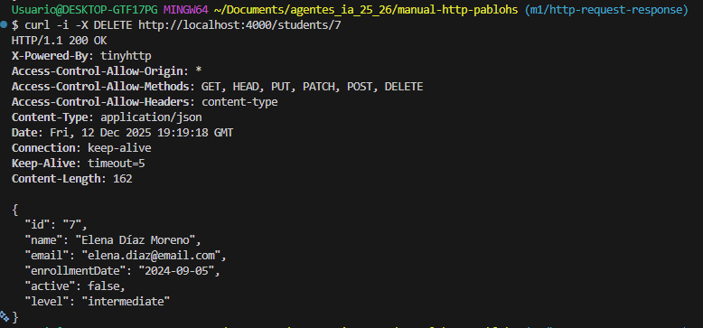


### Explicación del código de estado HTTP:

El servidor responde con un código 200 OK, lo que confirma que la solicitud se ha procesado correctamente.
Esto indica que el estudiante ha sido eliminado de la base de datos exitosamente.


## CAPTURAS DE LA EJECUCIÓN DEL SCRIPT CRUD:CURL

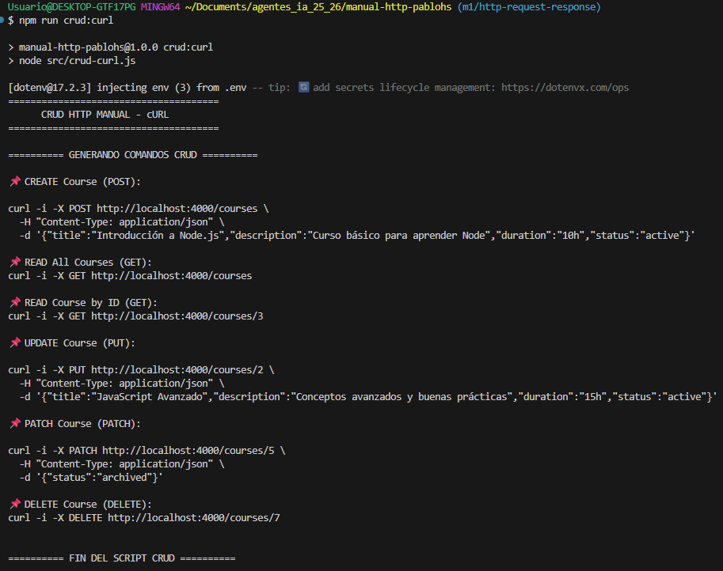
En la consola puede verse cómo se ejecuta el siguiente comando:

```bash
npm run crud:curl
```
Este script genera automáticamente todos los comandos cURL de las operaciones CRUD y los muestra por pantalla, junto con su estructura y formato final listo para copiar y ejecutar.

# Documentacion de operaciones CRUD con Thunder Client

## Peticiones en Thunder Client

En Thunder Client se deben crear las siguientes peticiones:

- **CREATE Student (POST)**
- **GET All Students (GET)**
- **GET Student by ID (GET)**
- **UPDATE Student (PUT)**
- **PATCH Student (PATCH)**
- **DELETE Student (DELETE)**

### Pasos para crearlas

1. Abre **Thunder Client** desde Visual Studio Code.  
2. Pulsa en **New Request**.  
3. Selecciona el metodo HTTP correspondiente (POST, GET, PUT, PATCH o DELETE).  
4. Escribe la URL de tu API (por ejemplo: `http://localhost:4000/students`).  
5. En las peticiones que lo necesiten, selecciona la pestaña **Body**, elige **JSON**, e introduce los datos correspondientes.  
6. Pulsa **Send** para ejecutar la peticion.  

---

## CREATE Student (POST)

Crea un nuevo estudiante en la base de datos.

**Metodo:** POST  
**URL:** `http://localhost:4000/students`  

**Body (JSON):**
```json
{
  "id": "10",
  "name": "Manuel García Sánchez",
  "email": "manuelgar@example.com",
  "enrollmentDate": "2023-08-02",
  "active": false,
  "level": "beginner"
}
```

**Captura:**  
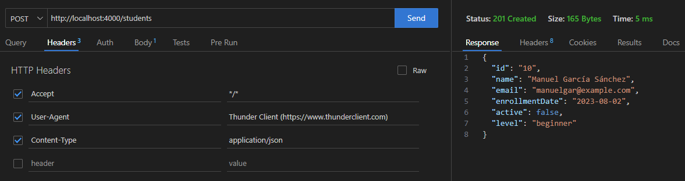

---

## GET All Students (GET)

Obtiene la lista completa de estudiantes.

**Metodo:** GET  
**URL:** `http://localhost:4000/students`  

**Captura:**  
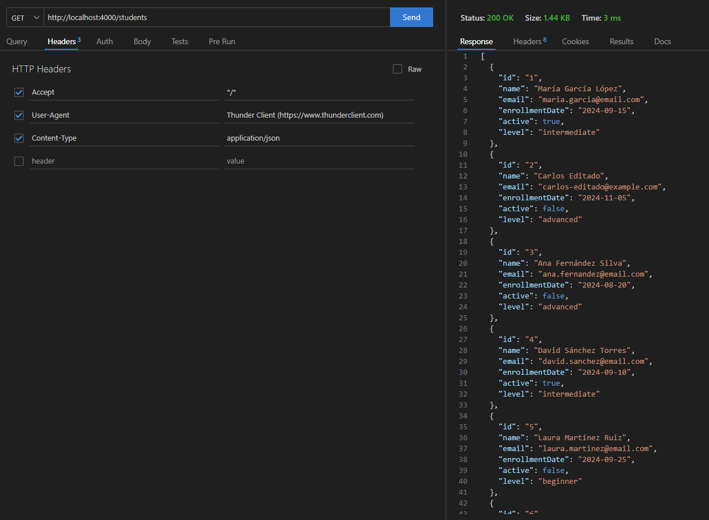

---

## GET Student by ID (GET)

Obtiene la informacion de un estudiante especifico segun su ID.

**Metodo:** GET  
**URL:** `http://localhost:4000/students/10`  

**Captura:**  
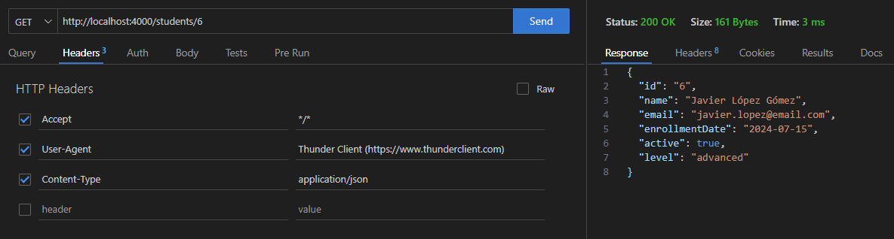

---

## UPDATE Student (PUT)

Actualiza completamente la informacion de un estudiante existente.

**Metodo:** PUT  
**URL:** `http://localhost:4000/students/20`  

**Body (JSON):**
```json
{
  "id": "10",
  "name": "Manuel García Sánchez",
  "email": "manuelgar@example.com",
  "enrollmentDate": "2023-08-02",
  "active": false,
  "level": "beginner"
}
```

**Captura:**  
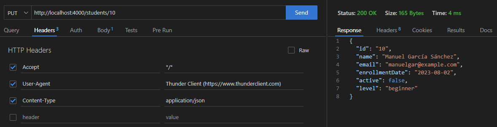

---

## PATCH Student (PATCH)

La operación **PATCH** permite modificar parcialmente los datos de un estudiante, sin necesidad de enviar todos los campos como ocurre con PUT.

En este ejemplo actualizamos el campo **status** del estudiante con **ID 5** (María Torres).

**Método:** PATCH  
**URL:** `http://localhost:4000/students/10`

**Body (JSON):**
```json
{
  "active": true
}

```

**Captura:**  
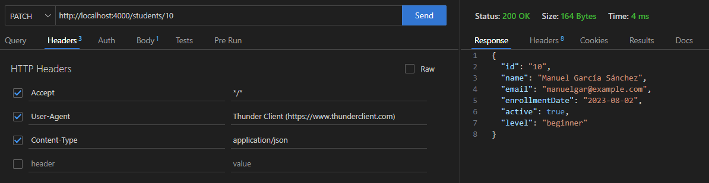

---

## DELETE Student (DELETE)

Elimina un estudiante por su ID.

**Metodo:** DELETE  
**URL:** `http://localhost:4000/students/10`  

**Captura:**  
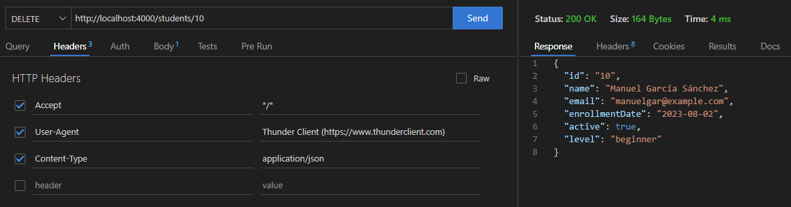


# Uso de REST API con Operaciones CRUD

A continuacion se muestran ejemplos practicos del uso de una **REST API** para realizar operaciones **CRUD** (Create, Read, Update, Delete) utilizando variables de entorno para hacer las peticiones mas flexibles y reutilizables.

---

## Variables de entorno

Estas variables se definen al inicio del archivo `peticiones-crud.http` para facilitar la configuracion de las peticiones:

```http
@baseUrl = http://localhost
@port = 4000
@apiUrl = {{baseUrl}}:{{port}}/students
@contentType = application/json
@idPrueba = idParaPruebas
```

**Descripcion de cada variable:**
- **@baseUrl:** Direccion base del servidor donde se aloja la API.  
- **@port:** Puerto en el que escucha la API.  
- **@apiUrl:** URL completa generada a partir de las dos anteriores.  
- **@contentType:** Tipo de contenido que se enviara (JSON en este caso).  
- **@idPrueba:** ID que usaremos para las pruebas de los endpoints.

---

## 1. Crear estudiante (CREATE)

### Metodo: `POST`

Ejemplo de peticion para crear un nuevo estudiante.  
Se especifica el metodo `POST`, la URL base y el cuerpo en formato JSON.

```http
POST {{apiUrl}}/students
Content-Type: {{contentType}}

{
    "id": "{{idPrueba}}",
    "name": "Alumno REST",
    "email": "alumno.rest@example.com",
    "enrollmentDate": "2025-09-20",
    "active": true,
    "level": "intermediate"
}
```

**Descripcion:**  
Esta peticion agrega un nuevo estudiante con los datos indicados.  
El servidor deberia devolver un codigo de estado **201 (Created)** y el objeto del estudiante creado.

**Captura:**  
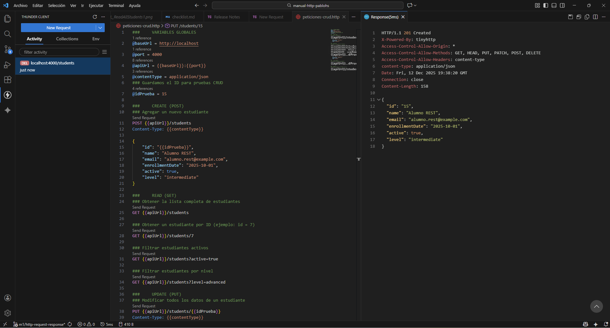

---

## 2. Actualizar estudiante (UPDATE)

### Metodo: `PUT`

Ejemplo de peticion para actualizar la informacion de un estudiante existente, usando su ID como parametro en la URL.

```http
PUT {{apiUrl}}/students/{{idPrueba}}
Content-Type: {{contentType}}

{
    "id": "{{idPrueba}}",
    "name": "Manuel Editado",
    "email": "edit-rest@example.com",
    "enrollmentDate": "2025-09-15",
    "active": true,
    "level": "advanced"
}
```

**Descripcion:**  
Esta peticion modifica los datos del estudiante identificado por `idPrueba`.  
El servidor deberia devolver un codigo **200 (OK)** y el objeto actualizado.

**Captura:**  
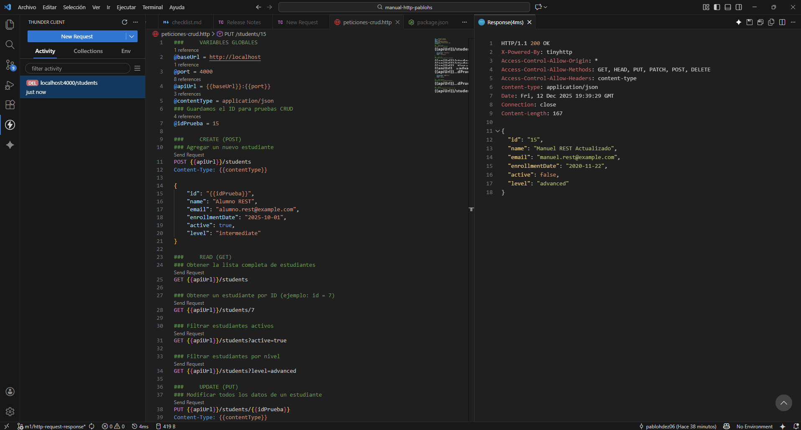